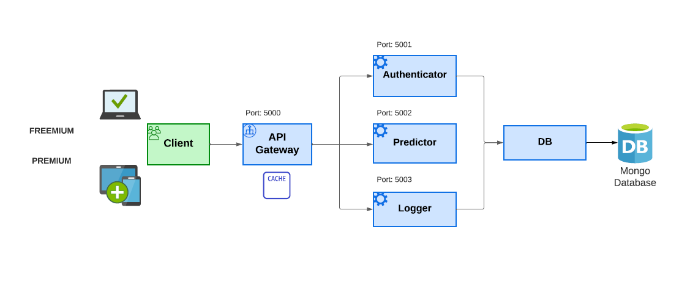

# TP Final de Tópicos de Ing. de Software 2 (2023) - UNLP 

En este repositorio, se presenta la solución propuesta para el [proyecto integrador](https://docs.google.com/document/d/1-rceIJhrVA3VBwmdT69tAKvkVJaLL9AIF9mbaSlDoLo/edit?usp=sharing) de la materia "Tópicos de Ingeniería de Software II". La propuesta implica el desarrollo de un servicio web (API) que ofrece acceso a un modelo de red neuronal.

El objetivo principal de este modelo es diagnosticar el riesgo cardíaco de un paciente a partir de datos clínicos proporcionados, tales como el nivel de colesterol, la presión arterial, el nivel de azúcar en sangre, la edad, el sobrepeso y el hábito de fumar.

### Integrantes de grupo:
Screpnik, Julieta\
Sánchez, Raúl

### Archivo de Colab (contiene el modelo de red neuronal)
<a href="[https://www.python.org/](https://colab.research.google.com/drive/1wzFBkpgvHLcpnaoYZS7NLwO11kPrR_Pb)" target="_blank">https://colab.research.google.com/drive/1wzFBkpgvHLcpnaoYZS7NLwO11kPrR_Pb</a>

## Instructivo para preparar el sistema y entorno virtual para correr la aplicación principal y los microservicios

**Paso 1:** Instalar Python (puede descargarse la  última versión de Python desde el <a href="https://www.python.org/" target="_blank">sitio oficial de Python</a>).

**Paso 2:** Crear un directorio para la aplicación.
```console
mkdir test
```
**Paso 3:** Abrir una terminal y dirigirse al directorio recién creado.
```console
cd test
```
**Paso 4:** Clonar el repositorio git en el directorio actual
```console
git clone https://github.com/fueguino84/tp_final_topicos2.git .
```
**Paso 5:** Ingresar al directorio .\app
```console
cd app
```
**Paso 6:** Crear un entorno virtual
```console
python -m venv venv
```
**Paso 7:** Activar el entorno virtual

En Windows:
```console
venv\Scripts\activate
```
En Linux o macOS:
```console
source venv/bin/activate
```
*Después de ejecutar este comando, verás el nombre de tu entorno virtual en la línea de comandos, indicando que el entorno virtual está activado.*

**Paso 8:** Instalar las dependencias en el entorno virtual
```console
pip install Flask==3.0.0 cachetools==5.3.2 requests==2.31.0 pandas==2.1.4 numpy==1.26.3 scikit-learn==1.3.2 tensorflow==2.15.0 matplotlib==3.8.2 pymongo==4.6.1
```
## Instructivo para correr la aplicación principal y los microservicios en un entorno local
*NOTA: Repetir los pasos 1 a 3 para cada servicio en una terminal diferente. Los servicios están configurados para ejecutarse en los puertos 5000 a 5003.*

**Paso 1:** Abrir la terminal y dirigirse al directorio raíz de la aplicación
```console
cd app
```
**Paso 2:** Activar el entorno virtual

En Windows:
```console
venv\Scripts\activate
```
En Linux o macOS:
```console
source venv/bin/activate
```

*Después de ejecutar este comando, verás el nombre de tu entorno virtual en la línea de comandos, indicando que el entorno virtual está activado.*

**Paso 3:** Ejecutar la aplicación y los microservicios asociados

**Microservicio Authenticator**
```console
cd microservices
python authenticator.py
```

**Microservicio Predictor**
```console
cd microservices
python .\microservices\predictor.py
```

**Microservicio Logger**
```console
cd microservices
python logger.py
```

**API Gateway**
```console
python gateway.py
```

## Tests HTTP para probar el funcionamiento de los servicios

Chequear la <a href="https://documenter.getpostman.com/view/11694927/2s9YsQ8q9W" target="_blank">Documentación de los tests HTTP en Postman</a> para mayores detalles.


## Documentación de la API

Chequear la <a href="https://raulsanchez.com.ar/topicos2/api-docs/index.html" target="_blank">Documentación de la API</a> para mayores detalles.

## Arquitectura 

<p align="justify">
A continuación, se presenta la arquitectura de software diseñada para cumplir con los requisitos necesarios para la construcción de un servicio web (API) que brinda acceso a un modelo de red neuronal capaz de predecir el riesgo cardíaco en pacientes. 

El modelo lógico del sistema se basa en una arquitectura de microservicios, donde cada uno representa la lógica de negocio. Cada microservicio opera en un puerto distinto. Este enfoque basado en microservicios facilita la escalabilidad, la comprensión del código debido a la separación de responsabilidades y la independencia entre los servicios.

El patrón aplicado es el Gateway o puerta de enlace que actúa como el punto de entrada único para la comunicación con todo tipo de clientes (freemium y premium) y enruta las solicitudes a los microservicios correspondientes (predictor, authenticator y logger).

El uso de este patrón permite controlar el flujo de carga que representa cada solicitud sin perder tiempo de trabajo en los microservicios para procesar dicha petición, ya que simplifica dicho proceso. Por lo tanto, la funcionalidad principal de la gateway es balancear la carga de los microservicios enviando las solicitudes mediante una cola de mensajes.

Dado que los microservicios se despliegan de forma independiente en puertos distintos, es probable que necesiten datos de otros microservicios para llevar a cabo sus tareas. En este sentido, la gateway asumirá la responsabilidad de gestionar estos datos entre los microservicios, evitando la comunicación directa punto a punto. Toda la interacción estará facilitada por la gateway. Esta estrategia reduce las dependencias y mejora la escalabilidad en el despliegue.

Además, se implementó un sistema de caché (TTLCache) para almacenar resultados previos de predicciones basadas en parámetros específicos. La caché mejora el rendimiento al evitar el cálculo repetido de resultados para las mismas entradas.
</p>




# ADRs

### ADR 001: Servicio de Autenticación de usuarios

**Contexto**

<p align="justify">
El sistema actual consta de un servicio de autenticación implementado en Flask que valida la autenticidad de las solicitudes HTTP utilizando API KEY proporcionadas en los encabezados. Además, se implementó un mecanismo de cuotas para limitar el número de solicitudes por minuto permitidas por usuario de acuerdo al tipo de cuenta (FREEMIUM y PREMIUM).

* FREEMIUM; 5 solicitudes por minuto (RPM).
* PREMIUM: 50 solicitudes por minuto (RPM).
</p>

**Decisión**

<p align="justify">
Decidimos implementar una solución basada en Flask para gestionar la autenticación y controlar las cuotas de solicitudes. Esta decisión se basa en las siguientes consideraciones:

1. Flask como Marco Web: flask proporciona una estructura simple y eficiente para construir servicios web, adecuada para nuestras necesidades de autenticación y cuotas.

2. Validación de API KEY: las API KEY se validan mediante la función llamada check_apikey(apikey) que consulta en la base de datos MongoDB en busca de la clave proporcionada. Esta validación garantiza que solo los usuarios autorizados tengan acceso al sistema.

3.  Control de Cuotas:  se implementó un mecanismo de control de cuotas para limitar la cantidad de solicitudes por usuario en un período de tiempo definido (1 minuto). Las cuotas se gestionan mediante la función check_quota(api_key, start_time, group). Los usuarios se clasifican en grupos ("FREEMIUM" o "PREMIUM") con cuotas específicas.
</p>

**Justificación**

<p align="justify">
Esta decisión se basa en la simplicidad y eficacia de Flask para gestionar la autenticación y cuotas de solicitudes. Además, la utilización de MongoDB para almacenar las claves API y las consultas permite una escalabilidad y flexibilidad adecuadas para los requisitos actuales del sistema.
</p>

**Consecuencias**

<p align="justify">

1. Simplicidad en la Implementación: flask proporciona una forma sencilla de implementar servicios web, lo que facilita la comprensión y mantenimiento del código.

2.  Escalabilidad: la estructura actual permite una fácil escalabilidad al utilizar una base de datos NoSQL como MongoDB para almacenar API KEY y datos relacionados con las consultas.

3. Monitoreo de Cuotas: se implementó una función de monitoreo de cuotas que registra el número de consultas realizadas por cada usuario en el último minuto. Esto facilita la identificación y gestión de solicitudes que superan las cuotas permitidas.

4. Flexibilidad en la Definición de Cuotas: la clasificación de usuarios en grupos permite una definición flexible de cuotas, adaptándose a las necesidades específicas de cada grupo de usuarios (FREEMIUM y PREMIUM).
</p>

### ADR 002  Servicio de Predicción de Riesgo Cardiaco

**Contexto**

<p align="justify">
El sistema actual consta de un servicio de predicción de riesgo cardiaco utilizando TensorFlow y Flask. El código proporciona un servicio web que realiza predicciones sobre el riesgo cardiaco de un paciente basado en parámetros médicos proporcionados (nivel de colesterol, presión arterial, nivel de azúcar en sangre, edad, sobrepeso y el hábito de fumar)
</p>

**Decisiones Tomadas**

<p align="justify">

1. Framework de Desarrollo: se utilizó Flask como el marco web para la implementación del servicio debido a su simplicidad y eficacia en la creación de servicios web en Python.

2. Bibliotecas de Machine Learning: TensorFlow es la biblioteca principal para cargar y ejecutar el modelo de predicción cardiaca. Ademas, se utilizó la biblioteca joblib para cargar el objeto scaler necesario para escalar las entradas antes de realizar predicciones con el modelo.

3. Modelo de Machine Learning: se usa un modelo de machine learning desarrollado y entrenado previamente con TensorFlow. El modelo se carga desde un archivo en formato Keras (model.keras) durante la ejecución del servicio, que contiene la arquitectura y los pesos del modelo entrenado.

4. Preprocesamiento de Datos: se utiliza la biblioteca NumPy para preprocesar los datos antes de realizar la predicción. Los datos de entrada se escalan utilizando un objeto scaler previamente entrenado y guardado en un archivo (scaler.joblib).

5. Formato de Entrada: el servicio acepta solicitudes HTTP POST en formato JSON, con los parámetros necesarios para la predicción (colesterol, presión, glucosa, edad, sobrepeso y tabaquismo).

6. Formato de Salida: el servicio devuelve la respuesta en formato JSON que indica si el paciente tiene riesgo cardiaco o no, junto con el valor de la predicción.
</p>

**Justificación**

<p align="justify">

1. Flask se selecciona por su facilidad de uso y su capacidad para construir servicios web de manera rápida y sencilla.
2. TensorFlow es una biblioteca líder en el campo del aprendizaje automático y es elegida para cargar y ejecutar el modelo de predicción de riesgo cardiaco.
3. El uso de un modelo previamente entrenado permite realizar predicciones de manera eficiente sin la necesidad de reentrenar el modelo en cada solicitud.
4. El preprocesamiento de datos, incluido el escalado, es crucial para garantizar que las entradas estén en el formato adecuado antes de realizar predicciones.
5. El formato de entrada y salida JSON proporciona una interfaz simple y fácil de entender para los usuarios del servicio.
</p>

**Consecuencias**

<p align="justify">
La implementación actual permite realizar predicciones de riesgo cardíaco de manera eficiente y rápida, pero cualquier cambio en el modelo requerirá ajustes en el código. Además, la elección de Flask y TensorFlow facilita la escalabilidad y la extensión del servicio en el futuro.
</p>

### ADR 003: Servicio de Registro de la API (log)
 
**Contexto**

<p align="justify">
El sistema actual consta de un servicio de registro en la API. El código captura los tiempos empleados para procesar las solicitudes HTTP, almacenando información sobre las consultas realizadas, parámetros utilizados, información del usuario y respuestas obtenidas para su posterior análisis y monitorización.
</p>

**Decisiones Tomadas**

<p align="justify">

1.  Almacenamiento de Datos: se utiliza MongoDB para almacenar los registros de las consultas realizadas. Se creó una colección llamada “log” en la base de datos “topicos2” para almacenar los registros.

2.  Estructura del Registro: cada entrada de registro contiene la siguiente información:
      - start_time: tiempo de inicio de la consulta.
      - params: parámetros de la consulta.
      - response: respuesta generada por la consulta.
      - elapsed_time: tiempo transcurrido durante la consulta.
      - end_time: tiempo de finalización de la consulta.
      - user_info: información del usuario asociada con la consulta.

3. Manejo de Tiempos: se calcula el tiempo transcurrido (elapsed_time) durante la consulta para registrar la duración de la operación.

4. Respuesta de la API: devuelve una respuesta en formato JSON indicando el éxito o fallo del registro de la consulta.
</p>

**Justificación**

<p align="justify">

1. MongoDB proporciona una solución eficiente y escalable para el almacenamiento de datos no estructurados, como los registros de consultas.
2. La estructura detallada de cada entrada de registro permite un seguimiento preciso de las consultas y sus resultados.
3. El cálculo del tiempo transcurrido durante la consulta ofrece información adicional sobre el rendimiento del sistema.
4. La respuesta en formato JSON facilita la interpretación de la confirmación del registro por parte de los clientes.
</p>

**Consecuencias**

<p align="justify">

La dependencia de MongoDB impone requisitos específicos para la configuración y gestión de la base de datos. Además, la información detallada almacenada en el registro puede resultar valiosa para el análisis, pero ocupa espacio adicional en la base de datos.
</p>


